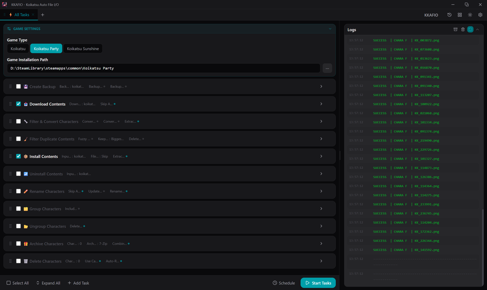

# KKAFIO: Koikatsu Auto File I/O



## Features

**1. Download Contents**

- Downloads character cards from [db.bepis.moe](https://db.bepis.moe) and [koikatsucards.com](https://koikatsucards.com).
- Enter one URL per line in the Download Links field. Supports individual card pages and listing pages.
- **Pagination formats** (use `|` as separator):

  | Format                                      | Behaviour                        |
  | ------------------------------------------- | -------------------------------- |
  | `https://db.bepis.moe/user/cards`           | Single listing page or card page |
  | `https://db.bepis.moe/user/cards \| all`    | All pages until empty            |
  | `https://db.bepis.moe/user/cards \| 1 \| 5` | Pages 1 through 5                |
  | `https://db.bepis.moe/user/cards \| 5 \| 1` | Pages 5 down to 1 (reverse)      |

- Lines starting with `#` are treated as comments and ignored.
- **Skip already downloaded** (on by default) uses a history file at `%APPDATA%/KKAFIO/download_history.json` to avoid re-downloading files.
- **koikatsucards.com session cookie** — downloading from koikatsucards.com requires a valid session. KKAFIO manages this automatically:
  - On first use (or when the session expires), KKAFIO opens [koikatsucards.com/login](https://koikatsucards.com/login) in your browser and shows a dialog asking you to paste the `kkd_session` cookie value from DevTools (F12 → Application → Cookies → koikatsucards.com).
  - The session is validated against `koikatsucards.com/api/session` before use. If it is expired, you are prompted for a new one automatically.
  - The session is stored in `%APPDATA%/KKAFIO/config/kkd_session.json`. It does not need to be entered in MXU settings.

**2. Download Missing Mods**

Finds all mods referenced by installed character cards that are not present in the local mods directory, then downloads them automatically.

See [Download Missing Mods Workflows](#download-missing-mods-workflows) below for recommended usage.

- **Step 1 — Mods cache:** Scans the mods directory and builds a cache of all installed mod GUIDs.
- **Step 2 — Chara scan:** Recursively scans the chara folders and collects every mod GUID referenced by installed cards. The result is cached for subsequent runs.
- **Step 3 — Missing = referenced − installed.**
- **Step 4 — Download:**
  - **BetterRepack** — Mods found in `kkafio_modpack_index_kk.json` / `kkafio_modpack_index_kks.json` are downloaded from [sideload.betterrepack.com](https://sideload.betterrepack.com), preserving the Sideloader Modpack folder structure.
  - **koikatsucards.com + Telegram** — Mods not in the modpack index are looked up on [koikatsucards.com/mod_library](https://koikatsucards.com/mod_library) and downloaded from the linked Telegram channel using your Telegram account via [Telethon](https://github.com/LonamiWebs/Telethon) and [teleget9527](https://pypi.org/project/teleget9527/) for maximum parallel speed.
  - If BetterRepack fails for a mod and Telegram is enabled, KKAFIO automatically retries via Telegram.
- **Sideloader Modpack mode:**
  - `Skip` — ignores all modpack GUIDs; only downloads non-modpack mods.
  - `Only Used` *(default)* — downloads missing modpack mods that are actually referenced by installed cards.
  - `All` — downloads every GUID in the modpack index not installed locally, even if no card uses it.
- **Custom Chara Directory / Custom Mods Directory** — leave blank to use the game's default directories. Set when using a staging folder workflow (see below).
- **Use Cache** (on by default) — caches both the mods list and the chara GUID scan. The chara cache is invalidated automatically when the chara folder changes.

**Telegram setup:**
1. Go to [my.telegram.org/apps](https://my.telegram.org/apps), log in, and create an app to get an **API ID** and **API Hash**. Enter these in MXU settings.
2. Enable **Download from Telegram** in MXU settings.
3. On first use, KKAFIO opens [my.telegram.org](https://my.telegram.org) in your browser and shows dialogs for your phone number and verification code (and 2FA password if enabled). The session is saved to `%APPDATA%/KKAFIO/config/tg_session/kkafio.session` and reused automatically.

> ⚠️ **Security notice:** Telegram API credentials and the session file give full access to your Telegram account. **We strongly recommend using a secondary/dedicated Telegram account** rather than your personal account. The session file is stored locally and never uploaded anywhere, but treat it like a password. Never share `%APPDATA%/KKAFIO/config/tg_session/` with anyone.

**3. Create Backup**

- Automatically creates a `.7z` archive containing:
  - `UserData`
  - `Mods` (excluding Sideloader Modpack)
  - `BepInEx`
- If an archive with the same name already exists it will be overwritten.

**3. Filter & Convert KKS Cards**

- Functions similarly to [FlYiNGPoTAToChiP's KK_SunshineCardFilter](https://github.com/FlYiNGPoTAToChiP/KK_SunshineCardFilter).
- Given a folder, the task:
  - Finds all **KKS** (Koikatsu Sunshine) cards and moves them into `_KKS_card_/`
  - Finds all **KK / KKSP** cards and moves them into `_KK_card_/`
  - **Convert KKS → KK**: produces KK-compatible copies in `_KKS_to_KK_/`
- **Optional:** Extracts ZIP / RAR / 7z archives before filtering.
- Has a separate archive password setting from Install Contents.

**4. Filter Duplicate Contents**

- Given a folder, scans recursively for duplicate `.png` cards and `.zipmod` files.
- Duplicates are detected by **content** (not filename):
  - PNG cards are fingerprinted using the character data payload embedded after the PNG IEND chunk, so two cards with different preview images are still caught as duplicates.
  - **Optional fuzzy matching** uses perceptual image hashing to detect updated cards with the same preview pose. Requires `pillow` and `imagehash`.
- Duplicates are moved into `_duplicates_/<category>/` subfolders:
  - `chara/` — KK / KKSP character cards
  - `coordinate/` — coordinate cards
  - `overlays/` — unclassified PNGs
  - `mods/` — zipmod files
- **Keep strategy** controls which copy of a duplicate set is kept in place: Newest, Oldest, Biggest file size (default), Smallest file size, Last alphabetically, First alphabetically, or None (move all copies).
- **Optional:** Send duplicates directly to the recycle bin instead of moving them.

**5. Install Contents**

- Given a folder containing chara cards, coordinate cards, overlays, and zipmod files, copies them into their respective game directories.
- Respects the configured **Game Type**: Koikatsu Sunshine installs all card types; Koikatsu / Koikatsu Party installs KK and KKSP cards. Cards of the wrong type are skipped with a log message.
- Scene cards (Studio) are installed only if the Studio `scene` folder is present.
- Extracts ZIP / RAR / 7z archives automatically (configurable).
- If both Filter & Convert KKS Cards and Install Contents are enabled with the same input folder, archive extraction runs in the filter step only to avoid double-extracting.

**6. Uninstall Contents**

- Reverse of Install Contents: given the same folder, deletes the matching files from the game directories.
- **Note:** Only use this if you selected **Rename** or **Replace** under file conflicts when installing.
- **Warning:** Uninstall Contents does not check whether a zipmod or coordinate file is shared with other characters before deleting it. Removing a zipmod used by multiple cards will break all of them. Only use this task when you are certain the files being removed are exclusive to the cards you are deleting. Files can still be recovered from the Recycle Bin.

**8. Rename Chara**

- Translates character card names to English using an LLM.
- Workflow:
  1. Select an input folder and click **Copy**.  
     KKAFIO scans all PNG cards (recursively), builds a JSON mapping `{character_key: {lastname, firstname, nickname}}`, merges it with the prompt, and copies the result to the clipboard.
  2. Paste into your LLM of choice. The LLM fills in the English name for each key.
  3. Copy the LLM response and click **Paste** in KKAFIO to save it.
  4. Enable **Rename Chara**, click **Start** — KKAFIO writes the translated names into each card's internal metadata (`Parameter.lastname / firstname / nickname`).
- **Update card metadata** (on by default): writes the translated names into the card file.
- **Rename PNG files** (off by default): also renames the file on disk to `Lastname_Firstname.png`. Files in subfolders stay in their subfolder.
- **Skip already renamed** (on by default): skips cards whose name is already in the local cache.
- Results are cached in `kkafio_rename_cache.json` inside the input folder and reused across runs.
- The prompt is fully editable in the settings panel.
- **Recommended LLMs:** same as Group Chara (see below).

**9. Group Chara**

- Groups character cards into subfolders named after their series, using an LLM.
- Workflow:
  1. Select an input folder, customise the prompt if desired, and click **Copy**.  
     KKAFIO scans the folder, builds a JSON mapping `{character_key: ""}`, merges it with the prompt, and copies the result to the clipboard.
  2. Paste into your LLM of choice. The LLM fills in the series name for each key.
  3. Copy the LLM response and click **Paste** in KKAFIO to save it.
  4. Enable **Group Chara**, click **Start** — KKAFIO moves each card into `<input>/<series>/`.
- **Include subfolders** option lets you export already-sorted cards too (off by default to skip them).
- **Recommended LLMs:**
  - [DeepSeek](https://chat.deepseek.com) — highly recommended: large context window, excels at identifying characters from Chinese gacha games (Genshin Impact, Honkai Star Rail, Arknights). Enable **Expert** for better identification of obscure characters.
  - [Claude](https://claude.ai) — strong general-purpose identification, particularly good for Japanese anime and game characters.

**8. Ungroup Chara**

- Reverse of Group Chara: moves all cards from subfolders back to the top-level input folder.
- **Optional:** Deletes empty subfolders after moving (on by default).

**9. Rename Chara**

- Translates character card names to English using an LLM.
- Workflow:
  1. Select an input folder and click **Copy**.  
     KKAFIO scans all PNG cards (recursively), builds a JSON mapping `{character_key: {lastname, firstname, nickname}}`, merges it with the prompt, and copies the result to the clipboard.
  2. Paste into your LLM of choice. The LLM fills in the English name for each key.
  3. Copy the LLM response and click **Paste** in KKAFIO to save it.
  4. Enable **Rename Chara**, click **Start** — KKAFIO writes the translated names into each card's internal metadata (`Parameter.lastname / firstname / nickname`).
- **Update card metadata** (off by default): writes the translated names into the card file.
- **Rename PNG files** (on by default): also renames the file on disk to `Lastname_Firstname.png`. Files in subfolders stay in their subfolder.
- **Skip already renamed** (on by default): skips cards whose name is already in the local cache.
- Results are cached in `kkafio_rename_cache.json` inside the input folder and reused across runs.
- The prompt is fully editable in the settings panel.
- **Recommended LLMs:** same as Group Chara (see above).
- **Warning:** Group Chara uses card metadata to extract character names. It is recommended to use **Rename Chara after Group Chara if Update card metadata is turned on**, as LLMs might not recognize the characters by their translated names.
- **Warning:** It is possible to modify the prompt to allow for transliteration, rather than limiting it to just the character's English name. However, the transliteration of Chinese characters can differ significantly from that of English characters. Transliterating Japanese characters tends to yield better results, although there may be exceptions.

**10. Archive Chara**

- Given a list of character cards, bundles each card with its matching coordinate files and required zipmods into a single archive.
- Coordinates are matched by colour fingerprint (not filename), so cards from different mod setups are handled correctly.
- Zipmods are found by GUID. Sideloader Modpack mods are excluded by default (see [Modpack Index](#modpack-index) below).
- **Auto-resolve**: if the card lives inside the game folder, mods and coordinate directories are inferred automatically. Override with **Custom Mods Directory** and **Custom Coordinate Directory** if needed.
- Output format: **7z** (default) or **zip**.
- **Combined archive** option puts all cards into one archive (default), or creates one archive per card.

**11. Delete Chara**

- Given a list of character cards, sends each card together with its matching coordinates and required zipmods to the recycle bin.
- Uses the same path resolution and coordinate matching as Archive Chara.
- Never touches Sideloader Modpack mods.
- **Warning:** Delete Chara does not check whether a zipmod or coordinate file is shared with other characters before deleting it. Removing a zipmod used by multiple cards will break all of them. Only use this task when you are certain the files being removed are exclusive to the cards you are deleting. Files can still be recovered from the Recycle Bin.

---

## Download Missing Mods Workflows

### Method 1 — Check installed cards (simple)

Use this to verify that all mods required by your currently installed cards are present. No staging folder needed.

1. Set **Sideloader Modpack** to `Only Used`.
2. Leave **Custom Chara Directory** and **Custom Mods Directory** blank (uses game defaults).
3. Enable **Download Missing Mods** and click **Start**.

KKAFIO scans your installed chara cards, finds any missing mod GUIDs, downloads missing Sideloader Modpack mods from BetterRepack, and (if Telegram is enabled) downloads any remaining mods from koikatsucards.com.

---

### Method 2 — Staging folder workflow ⭐ Recommended

This is the fastest end-to-end workflow for adding a large batch of new cards. All work happens in a temporary staging folder; the game directories are only touched at the final Install step.

```
📁 staging/            ← your staging folder (anywhere on disk)
```

**Step 1 — Download cards** *(optional)*

Use **Download Contents** to download cards from db.bepis.moe or koikatsucards.com directly into the staging folder. Or copy cards you already have into it manually.

**Step 2 — Filter & Convert** *(optional)*

Enable **Filter & Convert KKS** with the staging folder as input.
- Set **Extract Archives** on — this unpacks any ZIP/RAR/7z files in the staging folder before filtering.
- Enable **Convert KKS → KK** or **Convert KK → KKS** if you want cross-game copies.

**Step 3 — Deduplicate**

Enable **Filter Duplicate Contents** with the staging folder as input.
- Enable **Delete Duplicates** to send duplicates to the recycle bin instead of moving them to `_duplicates_/`.

**Step 4 — Download missing mods**

Enable **Download Missing Mods** with:
- **Sideloader Modpack** → `Skip` *(mods in the staging folder are local, not modpack mods)*
- **Custom Chara Directory** → your staging folder
- **Custom Mods Directory** → your staging folder
- **Download from Telegram** → enabled

KKAFIO scans the cards in the staging folder, finds which mods they reference, and downloads any missing ones into the staging folder alongside the cards.

**Step 5 — Install**

Enable **Install Contents** with the staging folder as input. KKAFIO copies everything — cards, coordinates, overlays, and zipmods — into the correct game directories.

---

## Game Type

Configure the game type in the instance settings at the top of the task list:

| Game Type | Card type installed | Cards skipped |
|---|---|---|
| Koikatsu (default) | KK, KKSP | KKS |
| Koikatsu Party | KK, KKSP | KKS |
| Koikatsu Sunshine | KKS | KK, KKSP |

The game type also determines which executable is launched by the **Run Game** button, which modpack index file is used, and affects scene card installation (Studio must be installed separately).

## Modpack Index

KKAFIO ships with two pre-built modpack index files:

| File | Game |
|---|---|
| `kkafio_modpack_index_kk.json` | Koikatsu / Koikatsu Party |
| `kkafio_modpack_index_kks.json` | Koikatsu Sunshine |

Archive Chara, Delete Chara, and Download Missing Mods use the index for the configured game type to instantly identify which required mods are covered by the Sideloader Modpack. If a GUID is not in the index, KKAFIO falls back to scanning the local mods folder automatically.

To regenerate the index after updating the Sideloader Modpack, run:

```
# Koikatsu / Koikatsu Party
python build_modpack_index.py "C:/KK Party/mods" --game-type kk

# Koikatsu Sunshine
python build_modpack_index.py "C:/KKS/mods" --game-type kks
```

**Incremental updates** — if the index file already exists, `build_modpack_index.py` reuses entries for zipmods whose path, size, and modification time are unchanged. Only new or changed zipmods are opened and scanned. Adding a handful of mods to a large Sideloader Modpack takes seconds rather than minutes.

Use `--full` to force a complete rescan and ignore the previous index:

```
python build_modpack_index.py "C:/KK Party/mods" --game-type kk --full
```

Copy the updated `.json` files next to `kkafio_cli.exe` or commit them to the repository to ship them with the next release.

## Context Menu Integration

Run `register_context_menu.bat` to add a **KKAFIO** submenu to the Windows Explorer right-click menu. It uses the selected file/folder as an argument; remaining settings are taken from the first configuration instance.

**On folders and folder backgrounds:**

| Entry | Action |
|---|---|
| Install Contents | `install-contents --input <folder>` |
| Uninstall Contents | `uninstall-contents --input <folder>` |
| Filter / Convert Chara | `filter-convert-chara --input <folder>` |
| Filter Duplicates | `filter-duplicates --input <folder>` |
| Download Missing Mods | `download-missing-mods --chara-dir <folder> --mods-dir <folder>` |
| Run GUI | Opens MXU |

**On PNG files (single or multi-select):**

| Entry         | Action                           |
| ------------- | -------------------------------- |
| Archive Chara | `archive-chara <selected files>` |
| Delete Chara  | `delete-chara <selected files>`  |

Run `unregister_context_menu.bat` to remove all entries.

## CLI Usage

`kkafio_cli` exposes every task as a subcommand. Arguments override config; omit them to use config defaults.

```
kkafio_cli run                                    # run all enabled tasks from config

kkafio_cli download-contents [--links URLS_OR_FILE] [--output-dir DIR]
                             [--skip-downloaded | --no-skip-downloaded]

kkafio_cli download-missing-mods [--mods-dir DIR] [--chara-dir DIR]
                                 [--use-cache | --no-use-cache]
                                 [--modpack-mode Skip|OnlyUsed|All]
                                 [--download-from-telegram | --no-download-from-telegram]

kkafio_cli create-backup  [--output DIR] [--filename NAME]
                          [--mods | --no-mods]
                          [--userdata | --no-userdata]
                          [--bepinex | --no-bepinex]

kkafio_cli filter-convert-kks [--input DIR]
                                [--convert-kks | --no-convert-kks]
                                [--extract-archive | --no-extract-archive]

kkafio_cli filter-duplicate-contents [--input DIR]
                             [--fuzzy | --no-fuzzy]
                             [--keep STRATEGY]
                             [--delete | --no-delete]

kkafio_cli install-contents   [--input DIR]
                           [--extract-archive | --no-extract-archive]

kkafio_cli uninstall-contents [--input DIR]

kkafio_cli rename-chara    [--input DIR] [--export]
                           [--response JSON_OR_FILE]
                           [--skip-already-renamed | --no-skip-already-renamed]
                           [--update-metadata | --no-update-metadata]
                           [--rename-files | --no-rename-files]

kkafio_cli group-chara     [--input DIR] [--export] [--include-subfolders]
                           [--response JSON_OR_FILE]

kkafio_cli ungroup-chara   [--input DIR]
                           [--delete-empty | --no-delete-empty]

kkafio_cli archive-chara   [CHARA ...] [--output-dir DIR]
                           [--format 7z|zip]
                           [--combined | --no-combined]
                           [--include-modpack | --no-include-modpack]
                           [--auto-resolve | --no-auto-resolve]
                           [--use-cache | --no-use-cache]
                           [--mods-dir DIR] [--coord-dir DIR]

kkafio_cli delete-chara    [CHARA ...]
                           [--auto-resolve | --no-auto-resolve]
                           [--use-cache | --no-use-cache]
                           [--mods-dir DIR] [--coord-dir DIR]

# Global options (all commands):
kkafio_cli --config PATH --instance N <command>
```

## Requirements

- 7-Zip installed and on PATH.
- If running from source: [uv](https://docs.astral.sh/uv/getting-started/installation/) installed.

## Installation and Usage

Download the latest release, extract it, and run `KKAFIO.exe`.

To run from source:

1. Clone or download this repository.
2. Install [uv](https://docs.astral.sh/uv/getting-started/installation/).
3. Run `uv sync` in the repository folder.
3. Run `uv run download_gui.py` to download the GUI.
4. Open KKAFIO.exe and configure settings to your preference.
5. Press **Start**.

## Known Issues

- Any `.png` that cannot be classified as a chara card or coordinate is treated as an overlay. Files in the wrong category can be found in `UserData/Overlays` — sort by date to identify and remove them.
- Studio scene cards are skipped if Studio is not installed (the `UserData/Studio/scene` folder does not exist).

## Acknowledgements

- [MistEO](https://github.com/MistEO) for the [GUI](https://github.com/MistEO/MXU).
- [Kiramei](https://github.com/Kiramei) for the logger. Original [here](https://github.com/Kiramei/blue_archive_auto_script/blob/master/core/utils.py).
- [FlYiNGPoTAToChiP](https://github.com/FlYiNGPoTAToChiP) for KK_SunshineCardFilter and the chara/coordinate distinction method.
- [Evaanxd](https://www.patreon.com/user?u=3125561) and [GaryuX](https://www.patreon.com/GaryuX) for the [Ryuko Matoi card and image](https://www.pixiv.net/en/artworks/77738576).
